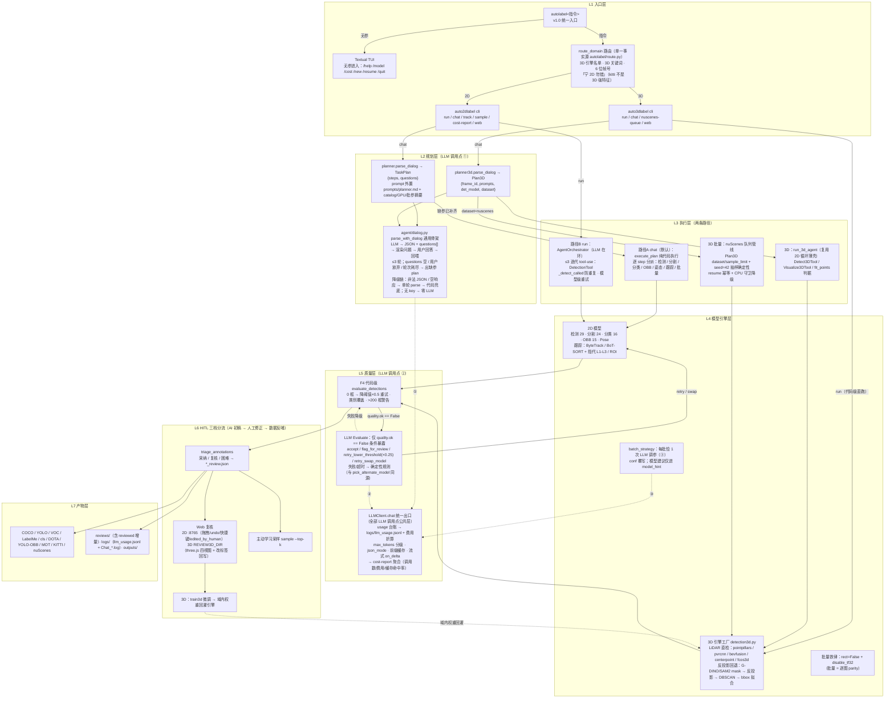

# 项目计划书

AutoLabel 是一个软件开发计划，其中暂定包括 **Auto2dLabel** 和 **Auto3dLabel** 两个子项目。**Auto2dLabel** 这个名字意味着通过借助当下先进的 CV 以及 LLM 模型自动生成2维标签，同理，**Auto3dLabel** 这个名字意味着借助这些模型自动生成3维标签。该计划秉持着先易后难的原则，先实现核心功能，再通过数据接口拓展其他功能。

## 项目背景

由于当前 AI 大爆发的背景，之前的大部分软件都可能需要被 Agentic AI 重制，其中包括自动化生成数据标签软件。传统的数据标注软件（如 CVAT、Label Studio）核心是「人工画布 + 快捷键」，自动化能力（预标注）作为辅助插件存在，其工作流仍然是「人为主、AI 为辅」。一个真正 Agentic 的标注软件应该将范式反转为 **「AI 为主、人为辅」**：用户只需下达自然语言指令，由 LLM Agent 自主规划、调用模型、评估结果、并在不确定时主动请求人工介入——这正是 AutoLabel 要做的。

## 总纲

**AutoLabel = Agentic 预标注层**，核心链路：

```text
自然语言指令 → Planner 任务规划 → 多模型引擎执行（检测/分割/分类/OBB）
  → 代码级质量评估（不达标时条件触发 LLM Evaluate）→ HITL 三档分流（auto/review/hard）
  → 多格式导出（COCO/YOLO/VOC/LabelMe/cls/DOTA/YOLO-OBB）
```

- **Auto2dLabel**：2D 六类任务逐版本推进（检测 → 分割 → 分类 → OBB → 3D 基石[Tracking/域内权重] → Pose），v0.1–v0.5 ✅，**v0.6 📋 对话式 Agent 统一入口**（2026-08-28 立项）；**为 Auto3dLabel 做基石**，优先交付支撑 3D 的内容（v0.4）
- **Auto3dLabel**：3D 标注（调研完成，MVP 走「2D 基础模型 → 3D 提升」路线，**2026-08-19 战略调整：主推进**，**v0.1 ✅（2026-08-24）+ v0.2 ✅（2026-08-27）+ v0.3 ✅（2026-08-31）+ v0.4 ✅（2026-09-02）**——P1 cuboid 手柄编辑 + P2 nuScenes 端到端标注闭环 + P3 KITTI 微调闭环，见 `auto3dlabel/milestone/`）
- **人工介入点**：低置信度自动入 review/hard 队列 + Web 审核界面 + 主动学习采样，Agent 不确定时主动求助

## Agent 工作流全景图（v1.0 P1+ 落盘状态，2026-09-06）

> 上文核心链路的代码级展开（L1 入口 → L2 规划 → L3 执行 → L4 引擎 → L5 质量 → L6 HITL → L7 产物）。
> LLM 决策点仅 3 处（① 对话式规划、② 质量处置、③ 批次调参）且条件触发——多 agent 编排框架不引入（论证见 `auto2dlabel/milestone/v0.6.md`）。
> 2D/3D 复用边界：`agent/dialog.py` 骨架 + `agent/llm.py` 统一出口为共享层，planner/planner3d 各自注入 prompt 与 schema。



## Target User（目标用户）

- **主要用户**：AI 算法工程师 / 数据科学家，需要为训练/微调模型快速生成高质量预标注，再在外部审核工具（Label Studio / CVAT）中精修
- **使用场景**：单人或小团队在消费级硬件（Apple Silicon / 单 GPU）上对百到千张级别图像进行自动预标注，容忍适度的人工审核
- **不是面向**：专业标注团队的大规模生产管线（需 Web 协作、权限管理、SaaS），也不面向零 AI 背景的标注员

## 项目范围

明确包含哪些子项目（Auto2dLabel / Auto3dLabel），以及**不包含**什么（Out of Scope），避免范围蔓延

### Auto2dLabel

2维数据标签在数学上通常是由点、线、面组成的节点、线段、矩形以及多边形。通过这些几何形状对一张 x*y 维度的图像上的若干个区域进行覆盖，从而生成针对若干个现实实体的标注。根据 **Ultralytics** 平台上的信息，2维标注可以分为：

**目标检测（Object Detection）**：一种涉及识别图像或视频流中物体的位置和类别的任务。检测器的输出是一组包围图像中物体的边界框，以及每个框的类别标签和置信度分数。

**实体分割（Instance Segmentation）**：比目标检测更进一步，涉及识别图像中的各个物体并将其从图像的其余部分中分割出来。模型的输出是一组勾勒出图像中每个物体轮廓的掩码或轮廓，以及每个物体的类别标签和置信度分数。

**图像分类（Image Classification）**：三种任务中最简单的一种，涉及将整张图像分类为一组预定义类别中的某一个。分类器的输出是单个类别标签和置信度分数。

**姿态估计（Pose Estimation）**：一种涉及识别图像中特定点（通常称为关键点）位置的任务。关键点可以表示物体的各个部位，如关节、地标或其他显著特征。模型的输出是一组表示图像中物体上关键点的点，通常附带每个点的置信度分数。

**OBB 模板检测（Oriented Bounding Box Object Detection）**：在传统目标检测的基础上增加了方向角度，使用旋转的边界框以更好地贴合物体的朝向，从而提高定位精度。这在航空或卫星图像等物体不与图像轴对齐的应用中特别有用。

**目标跟踪（Object Tracking）**：一种不仅识别帧内物体的位置和类别，还在视频推进过程中为每个检测到的物体维护唯一 ID 的任务。

在当前的计算机视觉工程中，大部分用到的还是2维数据标签

**Out of Scope（明确不做）**：3D 点云标注、医疗影像专业标注、需要专家先验的细粒度领域。

## 版本路线（Auto2dLabel）

| 版本 | 覆盖任务 | 状态 |
| --- | --- | --- |
| **v0.1** | 目标检测（3 引擎 × 29 模型）+ 实例分割（SAM2/SAM3/FastSAM/Mask R-CNN）+ 类别自动推荐 + Web 基础审核 + 9 数据集 Benchmark | ✅ 完成 |
| **v0.2** | 实例分割（SAM3）+ 类别推荐 + Web 审核（记录见 `auto2dlabel/milestone/v0.2.md`） | ✅ 完成 |
| **v0.3** | Image Classification（CLIP/SigLIP + torchvision 14 款）+ OBB（YOLO-OBB）+ M2/M3 闭环补全 | ✅ 完成 |
| **v0.4** | + 3D 基石（Tracking 视频时序 ID + KITTI 域 2D 质量 + Agentic 骨架收尾） | ✅ 完成 2026-08-23（见 `auto2dlabel/milestone/v0.4.md` 与 `auto2dlabel/tests/test-v0.4.md`） |
| **v0.5** | + Pose Estimation + VLM 指代检测（Florence-2/Qwen2-VL）+ 自动车道 ROI 等非 3D 内容（3D 使命完成后殿后；定义见 `auto2dlabel/milestone/v0.5.md`） | ✅ 完成 2026-08-23 |
| **v0.6** | + **对话式 Agent 统一入口**（chat 唯一入口 + LLM 多轮对话确定参数）+ mmdet/mmpose 双引擎 + LLM Harness Token 降本（定义见 `auto2dlabel/milestone/v0.6.md`） | ✅ 完成 2026-08-31（实测 `auto2dlabel/tests/test-v0.6.md`） |
| **v1.0** | + **Agentic 交互化**（产品形态跃迁：`autolabel` 命令 → Textual 对话式终端界面 + 多模型 API 可配置 + 后台任务面板 + 会话管理 + HITL 指挥台；企划见 `docs/Agentic_UI_plan.md`，执行指南见下方 §Agentic 交互化） | ✅ **P1 2026-09-02**（TUI 骨架 + 流式改造，四验收全过，实测 `auto2dlabel/tests/test-v1.0.md`）；**P1+ 2026-09-02** 批量 nuScenes 扩展（3D chat 直跑队列管线：Plan3D dataset/sample_limit + 抽样确定性 + CPU 守卫降级，用户原指令实测跑通）；**P2–P5 ✅ 2026-09-06**（P2 provider 注册表 `/model` 三态 + 台账 provider 字段 → P3 后台任务面板（`[AL_PROGRESS]` 行协议 + `/cancel` 两级终止 + `--resume` 续跑引导）→ P4 会话 JSONL（`/new` `/resume` 真实现）→ P5 HITL 指挥台（`/review` 三档统计 + `/web` 一键 Web 复核）；pytest 1267 + smoke_tui 31/31，质量门 pyright 0 / mypy 168 / ruff 86 存量不恶化） |

> 编号注记：早期路线表曾把「分类+OBB」标为 v0.2，实现时后移为 v0.3（v0.2 编号已被分割里程碑文件占用，不重命名现有文件）。
> 战略注记（2026-08-19）：Auto2dLabel 为 Auto3dLabel 做基石——优先交付能支撑 3D 的内容（原 v1.0 Tracking 提前至 v0.4），原 v0.4 Pose 平移至 v0.5；与 Auto3dLabel v0.1 双线并行。
> 战略注记（2026-08-28）：对话式 Agent 架构迭代优先——auto2dlabel v0.6 与 auto3dlabel v0.3 P1 双线并行（3D 复用通用对话骨架）；auto3dlabel v0.3 原 P1–P4（精度/融合/Web 3D/LabelAny3D）顺延为 P2–P5。

## 里程碑状态（Auto2dLabel）

| 里程碑 | 内容 | 状态 |
| --- | --- | --- |
| **M0 调研期** | 模型选型、竞品（CVAT / Label Studio / Roboflow）分析 | ✅ 完成 |
| **M1 单流程跑通** (v0.1a) | Agent Loop + DetectionTool + 3 引擎 × 47 模型 + CLI + COCO/YOLO/VOC 导出 + 日志 + 可视化 | ✅ 完成 |
| **M1b 分割** (v0.2) | SAM2/SAM3/FastSAM/Mask R-CNN 集成 + 类别推荐 + Web 基础审核 | ✅ 完成 |
| **M1c 价值证明** (v0.1c) | no-LLM 对照实验 + HITL 置信度三档分流（对照能力现于 `auto2dlabel/tests/helpers/no_llm_baseline.py`） | ✅ 完成 |
| **M2 服务化 + 前端审核** | FastAPI + 审核 UI + mask Canvas 叠加 + 复核队列闭环（消费方 + 保存回流 + 后端 COCO 导出） | ✅ 完成 |
| **M3 Agentic 闭环** | LLM Evaluate 节点（条件暴露）+ batch 失败隔离/--resume + 主动学习采样 | ✅ 完成 |

## 当前状态（2026-08）

| 项 | 状态 |
| --- | --- |
| **Auto2dLabel** | v0.1–v0.3 ✅：检测 + 分割 + 分类（CLIP/SigLIP + torchvision 14 款）+ OBB（YOLO-OBB）+ Web 闭环 + Agentic 闭环，**84 个模型**（含 cityscapes 域内 Mask R-CNN，全量 500 图 mAP 0.5149），**12 数据集 Benchmark**（含 DOTA OBB 旋转框；CPU 可行性 + GPU 复测均完成，见 `auto2dlabel/tests/test-v0.3.md`）；**v0.4 ✅ 2026-08-23**（Tracking Phase 1 ByteTrack + Phase 2 BoT-SORT/约束过滤/KITTI difficulty + **KITTI 域内微调 0.8867** + Phase 3 AgentState 续跑/模型级重试/Web 三件套，见 `tests/test-v0.4.md`）；**v0.5 ✅ 2026-08-23**（Pose YOLO-pose / 指代 L2 Florence-2 + **L3 Qwen2-VL-7B 4bit**（GPU 冒烟 33.2s，L2 失败自动升级阶梯）/ 自动车道 ROI UFLD / ILSVRC2012 val 分类扩展（全量 5 万图 top-1 0.6968 与官方一致）/ **Web 复核增强**（CVAT 借鉴：快捷键/undo/手柄/列表/过滤/右键/区域 issue + edited_by_human 数据回路 + 已复核重开，jsdom 冒烟 76/76），见 `tests/test-v0.5.md`；质量门 595/0/167/127）；**v0.6 ✅ 2026-08-31**（对话式 Planner 多轮收集 + mmdet 双引擎 **RTMDet/Mask2Former**（rtmdet_l 0.6179 ≈ fasterrcnn 0.6287 同档；mask2former mask mAP 0.6008 超两段式 SAM2 0.5778）+ mmpose **RTMPose 精度档**（0.5455 vs yolo11n-pose 0.4545）+ **LLM Harness**（usage 台账/前缀缓存命中率 97.7%/json mode/Evaluate 代码级降级）；实测修复 torch 2.6+ weights_only 拒载 + COCO 91→80 类别错位两 bug（均带回归），见 `auto2dlabel/tests/test-v0.6.md`）；**v1.0 P1 ✅ 2026-09-02**（Agentic 交互化：`autolabel` 统一入口（无参 → Textual TUI / 指令 → route_domain 路由一次性对话）+ ChatApp 骨架（斜杠命令 6 + 凭据横幅 + Worker subprocess 执行通道）+ LLM 流式改造（OpenAI/Anthropic 双协议，台账统一出口不动）；纯 CPU 新机器基线 mypy 183 / ruff 83 / pytest 1129 起，交付后 mypy 174 / ruff 74 / pyright 0/0/0 / pytest 1129 + smoke_tui 11/11，实测 `auto2dlabel/tests/test-v1.0.md`）；**v1.0 P1+ ✅ 2026-09-02**（批量 nuScenes 扩展：3D chat 分派队列管线（Plan3D dataset/sample_limit + seed=42 抽样确定性 + resume 幂等）+ CPU 守卫（bevfusion/centerpoint CUDA op 无 CUDA 自动降级 pointpillars_nus，E2E 用户原指令实测跑通）；pytest 1141）；**v1.0 P2–P5 ✅ 2026-09-06**（P2 provider 注册表：`configs/providers.yaml`（deepseek/openai/anthropic/ollama，`api_key_env` 只引用环境变量名）+ `/model` 列出/切换/set-key + runner 契约一次升级到 5 参（instruction/domain/provider/on_line/on_progress）+ per-provider 用量台账；P3 后台任务面板：`[AL_PROGRESS] done/total` stdout 行协议（4 挂点 cli_run/cli_commands/tracking/3D chat）+ TrackingTool `progress_cb`/`cancel_event`（`TrackingCancelled` 收敛既有 except ValueError 链）+ `/cancel` 两级终止（terminate→wait→kill）+ `--resume` manifest 续跑引导；P4 会话管理：`logs/chat_sessions.jsonl` 逐行落盘（子进程回显 record=False 防膨胀）+ `/new` `/resume` 真实现（重放不重跑任务）；P5 HITL 指挥台：`/review` 三档分流统计（2D 两档 + 3D 三档，如实按两侧 summary schema）+ `/web` 一键 spawn Web 复核（端口 env 检测 + 10s 轮询 + kill 指引）；质量门 pyright 0 / mypy 168 ≤169 / ruff 86 存量不恶化 / pytest 1267 / smoke_tui 31/31） |
| **质量门** | pyright 0 / mypy 169（auto2dlabel 基线不恶化）/ ruff 119（基线 127 不恶化）/ pytest 双环境 1046+1049 passed（每版本硬性门槛，命令与标准见 `Benchmark_plan.md` §10.6；auto3dlabel 侧归零：ruff 0 / mypy 0 / pyright 0） |
| **代码托管** | GitHub `GithubSherlock/AutoLabel`（private），权重与 `.env` 不入库 |
| **Auto3dLabel** | 调研 ✅，路线定案（2D → 3D 提升）；**2026-08-19 战略调整：主推进**；**v0.1 ✅ 2026-08-24**（单帧 KITTI 五步管线 + Agentic 闭环 + Web 复核 + 128 用例，质量门全绿；3D 层 AP 近零为反投影路线精度天花板实证，演进方向 CenterPoint/PointPillars）；**v0.2 ✅ 2026-08-27**（mmdet3d 硬装 PointPillars——KITTI 全 val 官方口径 Car 89.8/82.0/77.2 超 zoo + Tracker3D 多帧 + nuScenes Mini，实测 `auto3dlabel/tests/test-v0.2.md`）；**v0.3 ✅ 2026-08-31**（P1 对话式 Planner → P2 PV-RCNN/CenterPoint 精度档（pvrcnn_kitti 官方口径 / centerpoint_nus 23.4）→ P3 BEVFusion 融合（mAP 27.0）+ pgd KITTI 单目（33.7）→ P4 Web 真 3D 四视图复核（与 2D :8765 同端口共存）→ P5 LabelAny3D 8 步管线全链路验证（判据不达标 → 决策不接入，误差归因落盘）→ P6 模型矩阵扩展（FCOS3D 单目基准 mAP 0.8/car 8.0 + FreeAnchor 速度档 25.8 全 Mini 最快）+ 共享 Token 工程零实现受益，实测 `auto3dlabel/tests/test-v0.3.md`）；**v0.4 ✅ 2026-09-02**（P1 cuboid 手柄编辑（六面拖拽 + undo/redo，smoke 94 断言）→ P2 nuScenes 端到端标注闭环（bevfusion 队列 81 样本 → Web 复核点云 + 6 相机 → devkit 标签导出 → 回灌评测 mAP 24.6）→ P3 KITTI 微调闭环（pointpillars 300/40 帧冒烟训练 exit 0，40-point 主口径微调全面优于或持平官方，Car hard 76.4→80.5，实测 `auto3dlabel/tests/test-v0.4.md`） |

## 已知缺口 / 待办

（2026-08 核查遗留的三项已全部闭合：LLM Evaluate 节点、mask Canvas 叠加 + 复核队列、batch 失败重试均于 v0.3 周期完成，见 `auto2dlabel/milestone/v0.3.md` Phase 4）

| 缺口 | 归入 |
| --- | --- |
| Oriented R-CNN 未实现（mmrotate 依赖重，取舍注记） | 暂无计划 |
| DOTA Task1 旋转 GT 评测 | ✅ 已闭环（`dota_obb_benchmark.py` + rotate_iou，CPU 实测 0.7047 见 `auto2dlabel/tests/test-v0.3.md`） |
| 分类 Benchmark 补课（ImageNet100 ✅ + **ILSVRC2012 val ✅ 2026-08-23** 分层抽样接入（不整解压 6.7GB tar，devkit GT 单列行序格式兼容），12 数据集；cifar / CUB200 接入待排期） | v0.3 补课 / v0.5 分类扩展 |
| AgentState from_dict 恢复未实现（to_dict 快照已写） | checkpoint 完整版 |
| Web 审核：bbox 拖拽/标签编辑、分类与 OBB 结果展示 | 后续版本 |
| cityscapes 域内权重 | ✅ 已闭环（mmdet 官方权重转换接入 `maskrcnn_r50_cityscapes`，全量 500 图 mAP 0.5149，见 `tests/test-v0.3.md`） |
| dota/mot 域微调权重（GPU 复测定性为域边界：COCO 预训练模型在航拍/密集行人域失效，规模/SAHI/架构均无效） | 域微调路线（预标注 → 微调 → 回采闭环，AutoLabel 价值场景） |

## RAG 与多 Agent 演进调研（v1.1，2026-09-16 设计定案 → 2026-09-17 P1+P2 ✅）

> 动机：将标注经验沉淀为可检索知识（RAG）、将质检升级为生成-质检双 Agent。**P1 RAG 最小闭环 + P2 质检 Agent 独立化均已交付**（逐 Phase 质量门全绿，改动留工作区未 commit）。
> 红线约束：纯本地（向量库与 Embedding 均本地权重，不新增外部 API）、LLM 调用点不扩容（质检仅条件触发）、复用 `agent/dialog.py` 骨架与 Harness 台账、多 agent 编排框架不引入（沿用 v0.6 论证）。

### 0. P1+P2 交付摘要（2026-09-17）

- **P1 标注经验库**：`auto2dlabel/agent/experience.py`——`ExperienceEntry`（指令/域/数据集/任务类型/选型阈值/质量判定/人工修正）+ `build_entry` 纯代码构造（**零 LLM**）+ `append_entry` JSONL 入库（logs/experience.jsonl，去重）+ `retrieve` metadata 精确过滤 → CLIP 文本向量 top-k（复用已集成 ClipModel，`weights/hf` 缓存零新权重；transformers 5.x 取 `pooler_output`）+ numpy 暴力余弦（种子量小免 faiss）；入库挂 `cli_execute._finalize_step` 异步 daemon 线程不阻塞；种子 3 条（cityscapes 域权重 / DOTA 域失效 / 跟踪批量铁律）在 `configs/experience_seeds.jsonl`
- **P1 注入**：`planner.md` 加 `$experience_fewshot` 段；`planner._build_system_prompt(instruction)` 每次解析动态检索注入（import 期常量保留测试契约）；检索失败/空库静默降级 `""`
- **P2 质检 Agent（Critic）**：`auto2dlabel/agent/critic.py` + `prompts/critic.md`（独立 prompt 与 planner 不同源）+ `build_critic_client`（create_client 独立 provider，env `AUTOLABEL_CRITIC_PROVIDER` 覆盖默认 deepseek）+ `criticize` 独立 call_site `evaluate_critic`；触发 = `quality.ok == False`（与 LLM Evaluate 同一判据）挂在 `_finalize_step`，无 key/失败/非法 JSON 静默跳过；只出意见不执行重试（交叉校验降同模型自我确认偏差）
- **P2 cost-critic**：`auto2dlabel cost-critic` 子命令——aggregate_usage 过滤 evaluate_critic vs planner 调用点对比（复用台账单一事实源）
- **质量门**：pyright 0（3 = 基线 mapvec_crosscheck 存量）/ mypy 168 ≤166 基线不恶化（改动文件 0）/ ruff 74 存量不恶化（改动文件全绿）/ pytest 1352 passed + smoke_tui ALL PASS

> 备注：本节为设计 + P1/P2 实现摘要（2026-09-17 交付，改动留工作区）。Router Agent 暂缓——route_domain 代码级规则 17/17 手动 + 23 用例已覆盖，无规则误路由实证前不做（避免 LLM 分类扩容调用点 + 新失败面）。

### 1. RAG：标注经验库

**检索单元**：一次标注会话摘要 {指令, 域/数据集, 任务类型, 选型与阈值, 质量判定, 人工修正动作}；人工修正从 `*_reviewed.json` 的 edited_by_human/issues 提取——现有数据回路零新增采集。

**检索时点**：LLM 调用点 ① 规划——planner prompt 注入 top-k 相似历史案例作 few-shot（相似指令历史上用什么模型/阈值、出现过什么问题）；候选扩展调用点 ② 评估——注入「同类错误的历史处置先例」。

**选型**（守纯本地红线）：
- 向量库：FAISS（CPU 可跑；备选 sqlite-vec 免进程）；Embedding：本地 bge-small-zh-v1.5，图像侧复用已集成 CLIP 做图-文跨模态（找相似图的历史标注）
- 存储：向量（.index）+ 原文（JSONL）双文件同构；入库挂在 HITL 回流之后异步执行，不进标注关键路径
- 评估：复用 12 数据集 Benchmark 与 no-LLM baseline 套路，对比「注入历史案例 vs 无注入」的标注质量与 LLM 调用数

**种子条目**（首轮入库）：cityscapes 用 maskrcnn_r50_cityscapes（COCO 预训练对小目标失效）、DOTA/KITTI 域 COCO 权重失效需域微调、批量 rect=False/TF32 铁律——现散落于 CLAUDE.md 与测试文档，向量化后按指令相似度检索。

### 2. 多 Agent：路由 + 生成-质检对抗

> 多 Agent = 多套 prompt/schema + 独立 toolset，复用 dialog.py 骨架；providers.yaml 已支持质检用不同 provider/模型。

- **Router Agent**：route_domain 代码级规则保留为兜底，前置一次 LLM 轻量分类（域/任务/复杂度分档），低置信回退规则，单一事实源不变
- **标注 Agent（Generator）**：现有 planner + execute 路径出初稿，不动
- **质检 Agent（Critic）** ✅：LLM Evaluate 升级为独立质检——独立 prompt（`prompts/critic.md`）+ 不同模型（env `AUTOLABEL_CRITIC_PROVIDER`，默认 deepseek-chat、用户配更强模型），**quality.ok == False 条件触发**（用户定案，与 LLM Evaluate 同一判据）；增量价值 = 跨模型交叉校验，降低同模型自我确认偏差
- **成本口径**：`auto2dlabel cost-critic` 子命令——台账（Harness 已有）按 evaluate_critic call_site 聚合 vs planner 调用点对比（复用 aggregate_usage 单一事实源）

### 3. 版本归属与验收

- **v1.1 P1 ✅ RAG 最小闭环**（CLIP 文本向量 + numpy 暴力检索替代文档定案 bge+FAISS——复用已集成 ClipModel 零新权重、中文实测可用；对比基准 `experience_benchmark.py` 已交付并注册 `run_benchmarks.sh experience` 组）
- **v1.1 P2 ✅ 质检 Agent 独立化**（跨模型交叉校验 + quality.ok==False 触发口径 + cost-critic 成本对比）
- **验收**：① 纯本地零新外部 API ✅（CLIP 复用、numpy 暴力检索、create_client 既有 provider）；② 注入组 vs 基线组标注质量/LLM 调用数对比 ✅（`experience_benchmark.py`：同源 GT/检测器/评估协议，两组唯一差异 = few-shot 注入；CPU 3 图冒烟基线 0.6250 / 注入 0.6250；LLM 调用数 = planner call_site 台账聚合）③ 质量门不恶化 ✅（pyright 0 / mypy 168 / ruff 74 / pytest 1354 / smoke_tui ALL PASS）

## 下一步

（2026-08-19 战略调整：Auto2dLabel 为 Auto3dLabel 做基石——两模块**双线并行**：3D 主推进 v0.1 单帧 MVP，2D 侧优先交付支撑 3D 的内容（原 v1.0 Tracking 提前至 v0.4）；3D 使命完成后才做 Pose 等非 3D 内容（v0.5）。2026-08-17 首调：Auto3dLabel v0.1 提前——2D 基础能力已就绪、单帧 3D 不依赖 Pose/Tracking。2026-08-28 二调：**对话式 Agent 架构迭代优先**——v0.6（2D）+ auto3dlabel v0.3 P1（3D）双线并行，其余 3D 目标顺延。**2026-08-31 双双收尾**：auto2dlabel v0.6 ✅ 与 auto3dlabel v0.3 ✅（P1–P6 全完成）。**2026-09-02 auto3dlabel v0.4 ✅**：HITL 编辑闭环（P1 手柄编辑）+ nuScenes 端到端标注闭环（P2，回灌出表）+ KITTI 微调闭环（P3，40-point 主口径全面优于或持平官方）——「AI 初稿 → 人工修正 → 数据反哺模型」完整回路在 3D 侧闭环。**2026-09-02 三调：Agentic 交互化立项**——3D 侧闭环后主线回到产品形态跃迁，v1.0 P1（TUI + 流式）可开工（执行指南见上方 §Agentic 交互化执行指南）；3D 侧下一轮议题：自标注增量微调（P3b/P4，nuScenes 域）、无 LiDAR 域标注候选（v2+）。**2026-09-02 v1.0 P1 ✅**：TUI 骨架 + 流式改造交付（`autolabel` 统一入口 / ChatApp 斜杠命令 / chat() stream+on_delta 双协议 / route_domain 路由，pytest 1129 + smoke_tui 11/11 + 质量门不恶化）；下一议题 P2 provider 注册表）。**2026-09-06 v1.0 P2–P5 ✅**：Agentic 交互化剩余四阶段连续交付（P2 provider 注册表 → P3 后台任务面板 → P4 会话管理 → P5 HITL 指挥台，逐 Phase 质量门全绿；pytest 1267 + smoke_tui 31/31 + pyright 0 / mypy 168 / ruff 86 存量不恶化，全部改动留工作区未 commit）——「自然语言 → Agent 规划 → 多引擎执行 → 质量评估 → HITL 三档分流 → 复核回流」完整回路在 TUI 指挥台一站可操作；下一议题：3D 侧自标注增量微调（P3b/P4，nuScenes 域）、无 LiDAR 域标注候选（v2+））

| 优先级 | 事项 | 内容 |
| --- | --- | --- |
| 1 | **Auto3dLabel v0.1 单帧 3D MVP**（主推进）✅ 2026-08-24 | 路线 2：复用 G-DINO + SAM2 → mask 反投影语义点云 → DBSCAN 聚类 → 3D bbox 拟合 → KITTI 导出 + 3D/BEV IoU 评测 + Agentic + Web 复核（里程碑与验收见 `auto3dlabel/milestone/v0.1.md`，实测 `auto3dlabel/tests/test-v0.1.md`）。KITTI object 数据已就位：`Documents/datasets/KITTI/object` |
| 1' | **Auto2dLabel v0.4 3D 基石版**（双线并行）✅ 2026-08-23 | Tracking（ByteTrack，视频时序 ID——3D v0.2 多帧的跟踪 ID + 运动属性依赖）+ KITTI 域 2D 检测质量（benchmark 接入 + 域内微调权重）+ AgentState from_dict 收尾（里程碑见 `auto2dlabel/milestone/v0.4.md`） |
| 2 | **Auto3dLabel v0.2** ✅ 2026-08-27 | mmdet3d PointPillars（KITTI 全 val moderate 82.0 超 zoo）+ Tracker3D（ID + 速度）+ nuScenes Mini（实测 `auto3dlabel/tests/test-v0.2.md`） |
| 3 | **对话式 Agent 统一入口**（主推进，2026-08-28 立项） | **auto2dlabel v0.6**：`parse_dialog` 多轮对话确定参数（LLM 返回 JSON + questions[] → 渲染 → 用户回答 → 回喂 ≤3 轮）+ 通用骨架 `agent/dialog.py` + 降级链（非法/无 key → 单轮 parse + 代码兜底）+ `--no-wait` 兼容；**auto3dlabel v0.3 P1**：3D 侧复用骨架（Plan3D + questions）。多 agent 编排框架不引入（论证见 `auto2dlabel/milestone/v0.6.md`） |
| 4 | **Auto3dLabel v0.3 P2-P5**（P1 落地后）✅ 2026-08-31 | PV-RCNN KITTI + CenterPoint nuScenes 精度 + 难类收尾 → BEVFusion 融合（nuScenes + KITTI 降级方案）→ Web 真 3D 复核（three.js 四视图）→ LabelAny3D 无 LiDAR 域验证（里程碑见 `auto3dlabel/milestone/v0.3.md`） |
| 4' | **Auto3dLabel v0.4**（HITL 编辑闭环 + 训练微调闭环）✅ 2026-09-02 | P1 cuboid 手柄编辑（AI 初稿 → 人工修正几何完整化）→ P2 nuScenes 端到端标注闭环（队列 → Web 复核 → devkit 导出 → 回灌评测）→ P3 KITTI 微调闭环（mmdet3d 训练管线 + 同口径评测对比官方权重，40-point 主口径全面优于或持平）（里程碑见 `auto3dlabel/milestone/v0.4.md`） |
| 5 | 已知缺口消化 | mot 域微调权重（cityscapes ✅ 已闭环 0.5149，时机与域内数据同步）、分类数据集扩展（ImageNet100 ✅ + ILSVRC2012 val ✅，cifar/CUB200 待排期）、Web bbox 拖拽/标签编辑、分类与 OBB 的 Web 展示（已随 v0.4 Phase 3 消化） |
| 6 | **GPU 必需项**（2026-08-23 GPU 3080 Ti 到位，三项全部 ✅） | ① 指代 L3 Qwen2-VL-7B ✅（NF4 4bit ~4.5G，红车锁定冒烟 33.2s）；② KITTI 域内微调闭环 ✅（best.pt val mAP50 0.9430，官方口径 overall 0.8867 vs 基线全量同口径 0.2702；cityscapes 0.0082→0.5149 先例第二例）；③ 全量 ImageNet1k 5 万图基准 ✅（top-1 0.6968 / top-5 0.8899，440.8s） |
| 7 | **Agentic 交互化 v1.0**（2026-09-02 立项，企划 `docs/Agentic_UI_plan.md` 立项前提全满足）✅ 2026-09-06 | P1 ✅ 2026-09-02（TUI 外壳 + 流式对话，验收与实测见 §Agentic 交互化执行指南 / `auto2dlabel/tests/test-v1.0.md`）；P1+ ✅ 2026-09-02（批量 nuScenes 扩展）；P2 ✅ provider 注册表（providers.yaml + /model 三态 + per-provider 台账）→ P3 ✅ 后台任务面板（[AL_PROGRESS] 行协议 + /cancel 两级终止 + manifest 续跑引导）→ P4 ✅ 会话管理（logs/chat_sessions.jsonl + /new /resume 真实现）→ P5 ✅ HITL 指挥台（/review 三档统计 + /web 一键 Web 复核）；P2–P5 实测见 `auto2dlabel/tests/test-v1.0.md` |
| 8 | **RAG + 多 Agent 演进（v1.1，2026-09-16 设计定案 → P1+P2 ✅ 2026-09-17）** | P1 标注经验库 ✅（CLIP 文本向量 + numpy 暴力检索 + planner few-shot 注入 + 零 LLM 入库 + 种子 3 条）→ P2 质检 Agent 独立化 ✅（critic.md + 独立 provider 交叉校验 + evaluate_critic call_site + cost-critic 对比）；Router Agent 缓行（无规则误路由实证不做）；红线：纯本地、LLM 调用点不扩容、不引入编排框架；详见 §RAG 与多 Agent 演进调研 |

## 差异化定位

- **不是**：又一个标注画布工具（CVAT/Label Studio 已经做得很好）。
- **是**：一个 **Agentic 预标 + 多模型引擎 + 结构化日志 + 多格式导出**的自动标注层。用户说「检测汽车和行人」，系统自主选择 prompt、调模型、评估、导出——全程无需手动框选。

---

## Agentic 交互化执行指南（v1.0，2026-09-02 可开工 → 2026-09-06 P1–P5 全交付）

> 详细企划与评审记录见 `docs/Agentic_UI_plan.md`；本节 = 执行浓缩版（定案 + 分期 + 第一步 + 坑清单）。
> **状态（2026-09-06）**：**P1 ✅ 已交付**——① `autolabel` 统一入口（无参 → TUI；指令 → `route_domain` 路由一次性对话，2D/3D 两端零重构）；② ChatApp 骨架（对话区/输入区/Footer + 凭据横幅 + 斜杠命令 /help /model /cost /new /resume /quit + Worker 线程 subprocess 执行通道，runner 可注入）；③ LLM 流式改造（`LLMClient.chat()` 加 `stream: bool` + `on_delta` 增量回调，OpenAI/Anthropic 双协议，usage 台账统一出口不动，json_mode 与 stream 正交，响应仍全量返回解析兜底）+ 穿透链（dialog → planner×2 → cli 调用点×2）。四验收全过（进对话 / 流式输出 / /cost 出台账 / 无 key 降级提示）；新增 31 用例 + smoke_tui 11 断言，质量门与实测见 `auto2dlabel/tests/test-v1.0.md`。**P1+ ✅ 2026-09-02**（批量 nuScenes：3D chat 直跑队列管线 + CPU 守卫降级，E2E 用户原指令「随机 2 张 + 推荐模型」实测跑通出 2 队列文件；pytest 1141）。**P2–P5 ✅ 2026-09-06 连续交付**（逐 Phase 质量门全绿才进下一 Phase）：

- **P2 provider 注册表**：`auto2dlabel/configs/providers.yaml`（deepseek/openai/anthropic/ollama，`api_key_env` 只引用环境变量名、绝不含密钥；`api_key_env: null` 即本地端点免 key）+ `llm.py` ProviderSpec/load/create_client 四档模型解析 + `/model` 列出/`set <name>`/`set-key` 三态 + runner 契约一次升级到 5 参（`--provider` 透传子进程）+ 台账 provider 字段（旧行 `-` 容错）+ 红线修复（`auto3dlabel/configs/.env` git rm --cached + `.env.example` ×2）
- **P3 后台任务面板（差异化核心）**：`[AL_PROGRESS] done/total` stdout 行协议（4 挂点：cli_run 图像循环 / cli_commands 批量分支 / tracking 帧循环 / 3D chat 帧循环，协议行进面板不进对话区）+ TrackingTool `forward` 加 `progress_cb`/`cancel_event`（`TrackingCancelled` 抛 ValueError 子类收敛既有 except 链，finally video_writer 天然释放）+ `/cancel`（无参全量/带 id 单任务，terminate→wait(5s)→kill 两级 + `_ACTIVE_PROCS` 登记表按指令匹配）+ 任务面板（指令截断 40 字 + ProgressBar 不确定态转确定态 + 状态行）+ 取消后 `--resume` manifest 引导（TUI 从 stdout 缓存倒序扫提取）
- **P4 会话管理**：`logs/chat_sessions.jsonl` 单文件逐行 append（kind: user/assistant/system/task_result + task{id,status,manifest}；子进程回显 record=False 防膨胀；损坏行跳过/旧行缺字段容错）+ `/new`（新 session_id + 清屏 + seq 归零）+ `/resume`（无参列最近 5 会话 / `<session_id>` 逐行重放，markup 保真；重放不重跑任务，续跑走 manifest 引导）
- **P5 HITL 指挥台**：`/review` 三档分流统计（2D `outputs/*_review.json` 两档（无 accepted 如实展示）+ 3D `outputs/kitti3d/reviews/` 三档；`*.reviewed` 侧车排除；损坏 JSON 跳过；每次重扫零缓存）+ `/web [2d|3d]`（端口 env AUTOLABEL_PORT/AUTOLABEL3D_PORT 检测 → 已占用提示 / spawn detach（DEVNULL）+ 10s 轮询 → URL + kill 指引；web/ 无 `__init__.py` 走脚本路径 spawn）

质量门：pyright 0 / mypy 168 ≤169 / ruff 86 存量不恶化（P2–P5 文件全绿）/ pytest 1267 passed / smoke_tui 31/31；全部改动留工作区未 commit。红线顺带修复提醒：3D `.env` key 已进 git 历史（5b8768d 进入，已 git rm --cached 止血未来），**轮换与否由用户决定**。

### 一、定案（勿再讨论）

1. **形态**：Textual TUI 全屏对话（对标 Claude Code；Claude Code 本身即 Textual 实现）
2. **版本归属**：Auto2dLabel **v1.0 主线**
3. **HITL**：TUI 指挥台 + Web 复核（复核本体复用现有 Web，不重造）
4. **入口**：`autolabel` 统一命令（无参 → TUI；`autolabel "指令"` → 一次性对话）；旧 `auto2dlabel/auto3dlabel` 命令**原样保留**（防既有脚本 break，P1 不透传子命令）

### 二、分期（P1 → P5）

| 期 | 内容 | 验收 |
| --- | --- | --- |
| **P1** | TUI 骨架（对话区/输入区/Footer）+ 斜杠命令（/model /cost /new /resume /help /quit）+ **LLM 流式改造**（`LLMClient.chat()` 加 `stream: bool` + 增量回调；usage 台账统一出口不动；json_mode 流式展示 + 全量解析兜底） | `autolabel` 进对话、流式输出、/cost 出台账、无 key 全流程可跑（显示「无凭据 → 代码直跑」降级提示） |
| **P2** | `configs/providers.yaml` provider 注册表 + `/model` 列出/切换（Ollama/vLLM/本地 Qwen 兼容端点）；`estimate_cost_rmb` 按 provider 区分 | 切换任意已配置 provider 生效；无 key provider 启动即降级提示 |
| **P3** | **后台任务面板（差异化核心）**：Tool 调用进 Textual Worker（进度 `progress_cb` / Ctrl+C 取消 `cancel_event` / 断点续跑复用 batch `--resume` + `AgentState`）；工具契约扩展过 `tools/registry.py` 可选注入，同步路径兼容 | 批量标注显示进度、可取消、取消后 `--resume` 续跑 |
| **P4** | 会话 JSONL（消息历史 + 任务记录），/new 新会话、/resume 恢复上下文 | 中断后 /resume 恢复对话与任务状态 |
| **P5** | HITL 指挥台：三档分流统计表 + 一键启动 Web 复核（spawn server + 端口检测 + 打印 URL） | 标注完 → 看分流 → 回车开 Web → 复核回流（走既有 `*_reviewed.json` 链路） |

远期（不承诺）：MCP 接入 / TUI 内嵌轻量三档确认 / 插件体系 / 跨机器 GPU 编排。

### 三、P1 第一步动作（下次启动照做）

```bash
pip install "textual>=8.2.8,<9"          # 锁上界（8.x 重构中）；rich 15 已装零升级
# 新顶层包 autolabel/（薄壳，不入 agent/models 逻辑）：
#   cli.py    — typer app：无参 → TUI；指令参数 → 一次性对话
#   route.py  — route_domain() 单一事实源（见下）
#   tui/app.py— Textual App 骨架（对话区/输入区/Footer/Worker）
# pyproject：name = "autolabel"（发行名）+ scripts.autolabel + include 加 autolabel*；pip install -e . 重装
```

**路由判据（route.py，含边界修正）**：`det_model` ∈ `DETECTOR3D_NAMES` → 强制 3D；指令含 3D 强特征词（点云/lidar/velodyne/`3d( bbox|框|检测)` + 6 位帧号）→ 3D；含 `kitti` 但无 3D 特征、`-d` 为 2D 模型 → **2D**（「KITTI」不能当 3D 强特征词——`kitti_finetune` 是 2D 模型）；其余 → 2D 默认。一次性对话直接 import 现有函数（2D `cli_commands.chat_command` / 3D `auto3dlabel.cli.chat` 命令体），**两端零重构**。

### 四、红线（继承 + 新增）

- **继承**：纯本地（Textual 零服务端）；无 key 零影响；权重与 .env 不入库；质量门 pyright/mypy/ruff/pytest 全绿；复用不复制（Agent 循环/Web 复核/成本台账全复用）
- **新增**：① 流式不破坏台账统一出口（`chat()` 签名向后兼容）；② TUI 可测（Textual `run_test` + Pilot 冒烟，零真实权重 Fake 注入沿用，对标 jsdom 冒烟铁律）；③ 长任务取消必须清理（显存/子进程，宁失败不悬挂）；④ 双入口并存期

### 五、已知坑（写码必读）

1. **Textual 8.x API 重构**（勿凭 0.x/6.x 旧版记忆）：Footer 无 `.content`、App 无 `.bindings`（内化 `_bindings`）、Label 无 `.renderable`——渲染断言统一走 `export_screenshot()`；**SVG 里空格被编码为 `&#160;`**，字符串断言用无空格片段；**顶层 `textual.widgets` 无重导出**（8.2.8 实测，组件在 `_input`/`_static`/`_footer` 私有子模块，P1 直接 import 具体子模块）；**py.typed 为 partial** → mypy 报 `App`/`work` 未类型化，行级 `# type: ignore`（textual 通配 override 不生效，错误报在 autolabel 模块）
2. 每个组件属性访问先 `dir()` 实测，把验证写进测试（8.x 频繁内化）
3. 本项目与 Claude Code 的本质差异：**工具是秒~分钟级推理任务**——TUI 必须带后台任务面板（对话区可继续输入），这是 P3 最大工程增量，P1 骨架即预留 Worker 挂点
4. 无 key 降级链在 TUI 内保持（`has_credentials` 判定 + 代码级兜底，v0.6 红线不回归）
5. **推理模型禁用低温（2026-09-02 实测）**：`deepseek-v4-flash` 等推理模型在 planner 低温确定性请求（temperature=0）下推理链吃满 max_tokens 产出空 content（temp=0.1 → reasoning 1023/content 0）——`chat()` 统一出口已钳制（温度 1.0 + 预算 ≥4096，测试锁死），但推理长度高方差仍可能截断；**标注规划任务 .env 用 `deepseek-chat`**（.env 注释已警示）
6. **TUI 子进程必须 `-u` 无缓冲**：stdout 连 pipe 时 Python 默认全缓冲，输出积压到进程退出才 flush，TUI 表现为「无响应」（回归断言锁死）

---

## Auto3dLabel

> 本部分为 3D 标注现状调研（2025-08），作为 Auto3dLabel 的规划输入。核心结论：**3D 标注远不止 3D bbox**；自动标注存在四条主流技术路线，建议 MVP 走「2D 基础模型 → 3D 提升」，远期评估「重建驱动（NeRF/3DGS）」。

### 1. 3D 标注对象（标的是什么）

| 任务 | 标注内容 | 代表数据集 |
| --- | --- | --- |
| **3D 目标检测** | 3D bbox（中心 + 尺寸 + 朝向 yaw） | KITTI、nuScenes、Waymo |
| **3D 语义分割** | 点云中每个点打类别标签 | SemanticKITTI |
| **3D 实例分割** | 每个点类别 + 实例 ID | SemanticKITTI、Waymo |
| **目标跟踪** | 跨帧给同一物体维持唯一 ID | nuScenes、Argoverse |
| **3D 占用网格 (Occupancy)** | 空间体素化为 occupied/free/类别 | Occ3D-nuScenes |
| **HD 地图 / 车道线** | 车道线、路沿、停止线的 3D 折线 | Argoverse、nuPlan |
| **可行驶区域** | BEV 下的路面多边形 | 车企内部数据 |
| **运动属性** | 每帧速度、加速度、静止/移动状态 | nuScenes |
| **关键点** | 车辆四角点、人体骨架 3D 关键点 | 内部数据 |

其中 bbox + 跟踪 ID + 运动属性通常作为「一套标注」同时完成。

### 2. 人工标注的实际工作流

现代 3D 标注工具（Scale AI、Segments.ai、车企自研平台）界面均为**多视图协同**：

1. **BEV 俯视图为主视图**——标注员在鸟瞰图上画旋转矩形，天然贴合 bbox 定义
2. **侧视图/正视图辅助微调**——高度、俯仰角在侧视图调整
3. **点云投影到相机图像**——多相机同步显示，用于确认被遮挡物体的类别和边界
4. **时序传播辅助**——标好首帧后用跟踪传播到后续帧，人工只修漂移

关键事实：**纯人工逐点标注点云分割不现实**（单帧几十万点），3D 语义/实例分割实际都是「自动生成候选 + 人工修正」。

### 3. 自动标注技术路线（2025–2026 现状）

| 路线 | 方法 | 代表工作 | 点评 |
| --- | --- | --- | --- |
| **1. 模型伪标签** | 已有 3D 检测/分割模型直接出预测，人工审核 | 行业标准（各车企预标注管线） | 需先有 3D 模型；配合主动学习只审低置信度样本 |
| **2. 2D 基础模型 → 3D 提升** ⭐ | Grounding DINO / SAM2 出 2D 框/mask → 反投影点云 → 聚类成 3D mask / 拟合 bbox → 多视角一致性融合 | AutoLabel-2D (IEEE 2025) | **复用 Auto2dLabel 已有能力**，无需 3D 模型，最符合「先易后难」 |
| **3. 重建驱动（NeRF / 3DGS）** | 先重建场景，在重建上标一次 → 为所有帧生成一致标签，天然解决遮挡 | GS-Occ3D (ICCV 2025)、AutoOcc (ICCV 2025)、VESPA (CVPR 2026)、NeuRAD | 3DGS 已取代 NeRF 成为主流（可扩展性好）；质量最高但计算开销大、对消费级硬件不友好；动态物体需单独建模防拖影 |
| **4. 纯视觉 / 伪 LiDAR** | 单目/双目估深度生成伪点云 → 上面做标注 + VLM 校验闭环 | Pseudo-LiDAR + VLM (TRC 2026) | 有 LiDAR 走路线 2、无 LiDAR 走路线 3 时，路线 4 两头不讨好（详见调研讨论） |

**行业趋势**：从依赖 LiDAR 转向纯视觉管线（LiDAR 采集车成本高）；3DGS 取代 NeRF；VLM 驱动开放词汇标注；显式动态物体建模；光线投射区分 observed/unobserved 体素。

### 4. Auto3dLabel 路线建议

1. **MVP 走路线 2（2D → 3D 提升）**：已有 Grounding DINO + SAM2 + ByteTrack 全套 2D 能力，新增「点云加载 → 2D mask 反投影 → DBSCAN 聚类 → 多视角投票 → bbox 拟合」模块即可产出 3D bbox 初稿
2. **3D 输入**：先支持单帧点云 + 多相机（nuScenes / KITTI 格式），再扩展时序
3. **跟踪 ID + 运动属性**：跨帧 ID 维持与速度估计是 3D 标注最具价值的增量（衔接 Auto2dLabel v1.0）
4. **VLM 校验**：LLM 判断 bbox 是否贴合点云/图像，作为低成本高收益的审核环节（参考 VESPA 思路）
5. **3DGS 路线（路线 3）**：质量最高但需 24GB+ 显存 GPU 与长时间训练，列为远期（详见架构讨论，未写入本文件）
6. **输出格式**：目标支持 nuScenes / KITTI / Waymo Open Dataset 标注格式导出

### 5. 竞品分析：AutoLabel-2D（IEEE 2025）

论文《An Auto-Labeling tool for Occupancy Grid and BEV in Autonomous Driving Dataset》是「2D → 3D 提升」路线的真实实现，与本项目直接相关（连命名都接近）。

**技术管线**（据摘要推断）：

```text
输入: 多相机图像 + LiDAR 点云（含相机-LiDAR 外参标定）
  │
  ├─ [A] 2D 语义分割（多模型集成）
  │     Grounding DINO ──► 开放词汇 bbox ──┐
  │     YOLOv7        ──► 快速检测 bbox ────┼─► SAM2 ──► 2D mask
  │     GAI prompt 精炼 ◄── 失败区域反馈 ───┘  （边界/远距离优化）
  │
  ├─ [B] 投影：2D mask ──外参标定──► 语义 LiDAR 点云
  ├─ [C] 多帧融合 + 动静分离（位姿对齐累积；动态物体跟踪/场景流分离）
  ├─ [D] 占据网格：体素化 + 光线投射 ──► occupied/free/semantic 网格
  │
  输出: 语义点云 + 3D 语义占用网格 / BEV 图
```

**相同点**：基础模型（Grounding DINO + SAM2）完全重合；同走 2D → 3D 提升路线；同为模块化设计；同面向自动驾驶街景。

**关键区别**：

| 维度 | AutoLabel-2D | 本项目 AutoLabel |
| --- | --- | --- |
| 核心范式 | 固定 pipeline | Agentic 编排（LLM 规划/评估/请求人工） |
| LLM 角色 | 仅作 prompt 精炼模块 | 编排器 + HITL 分流 |
| 输出产物 | 语义点云 + 占用网格（HD 地图/场景理解） | 训练标签（COCO/YOLO bbox 等） |
| 人工介入 | 无（全自动） | HITL 三档分流 + 主动学习回流 |
| 模型策略 | 多模型集成（YOLOv7 + G-DINO 互补） | 47 模型 × 3 引擎可选切换 |
| 2D/3D 范围 | 纯 3D | 2D 六类任务 + 3D 预留 |

**对本项目的启示**：

1. 路线 2 可行性被验证：其阶段 A（G-DINO + SAM2）恰是 Auto2dLabel 已有能力
2. 差异即机会：它无 HITL、无训练标签导出、无 Agentic 编排——这三样正是本项目的差异化定位；其 pipeline 可作为 Auto3dLabel 的 no-LLM baseline，叠加 Agent 决策 + 人工审核闭环
3. YOLOv7 与 G-DINO 集成互补召回的做法值得借鉴，Auto3dLabel 阶段可考虑多模型投票融合
